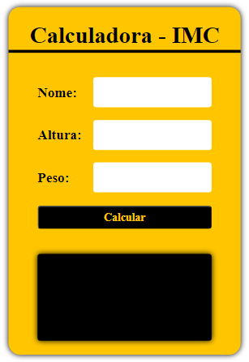
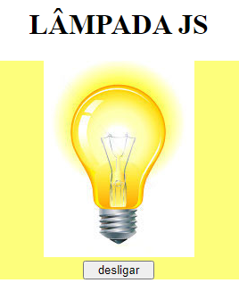
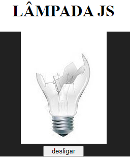
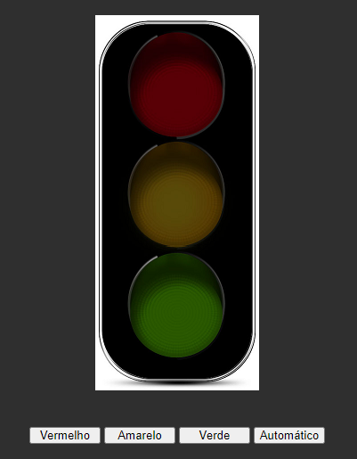

# mini_projetos_javaScript
 Conhecendo e entendendo JavaSccript

 ## 1. Calculadora de IMC

 

## 2. Lâmpada

Acenda, apague ou quebre a lâmpada.

   

## 3. Semáforo

Controle o semáforo entre vermelho, amarelo, verde e modo automático clicando nos botões.

  
