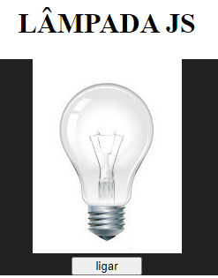

# mini_projetos_javaScript
 Conhecendo e entendendo JavaSccript.

 ## 1. Calculadora de IMC

 

## 2. Lâmpada

Acenda, apague ou quebre a lâmpada.

   

## 3. Semáforo

Controle o semáforo entre vermelho, amarelo, verde e modo automático clicando nos botões.

  

## 4. Slideshow

Visualize imagens utilizando os botões de previous ou next.

 

## 5. Drum Kit

Toque bateria com as teclas disponíveis.

 

## 6. Calculadora

Faça cálculos simples usando o mouse ou o teclado.

 

## 7. Count Down

Faça uma contagem regressiva do seu evento.

 

## 8. To Do List

Faça uma lista de suas tarefas para não esquecer.

 

## 9. Crud

Criar, ler, atualizar e excluir.

 

## 10. Conversor de base numérica

Converta números entre binário, decimal, octal e hexadecimal.

 